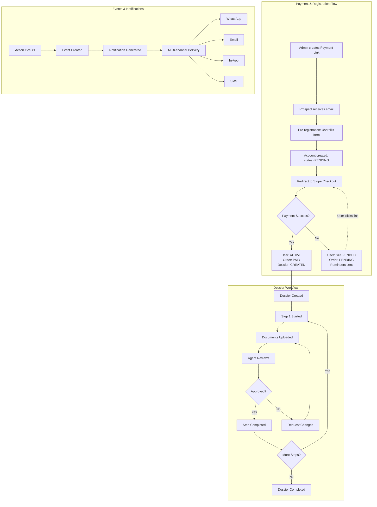

# Partners VRAI - Database ERD

## Entity Relationship Diagram

```mermaid
erDiagram
    %% ===================================================
    %% CORE ENTITIES
    %% ===================================================

    PROFILES ||--o{ DOSSIERS : "owns"
    PROFILES ||--o{ ORDERS : "places"
    PROFILES ||--o{ NOTIFICATIONS : "receives"
    PROFILES ||--o{ PAYMENT_REMINDERS : "receives"
    PROFILES {
        uuid id PK
        text full_name
        text phone
        user_status status
        text stripe_customer_id UK
        timestamptz created_at
        timestamptz updated_at
    }

    AGENTS ||--o{ PAYMENT_LINKS : "creates"
    AGENTS ||--o{ STEP_INSTANCES : "assigned_to"
    AGENTS ||--o{ DOCUMENT_REVIEWS : "reviews"
    AGENTS {
        uuid id PK
        text email UK
        text name
        boolean active
        timestamptz created_at
        timestamptz updated_at
    }

    %% ===================================================
    %% PRODUCTS & WORKFLOW
    %% ===================================================

    PRODUCTS ||--o{ PRODUCT_STEPS : "defines"
    PRODUCTS ||--o{ PAYMENT_LINKS : "offered_via"
    PRODUCTS ||--o{ ORDERS : "purchased"
    PRODUCTS ||--o{ DOSSIERS : "creates"
    PRODUCTS {
        uuid id PK
        text code UK
        text name
        text description
        dossier_type dossier_type
        text stripe_product_id UK
        text stripe_price_id
        integer price_amount
        text currency
        dossier_status_code initial_status
        boolean active
        timestamptz created_at
        timestamptz updated_at
    }

    STEPS ||--o{ PRODUCT_STEPS : "belongs_to"
    STEPS ||--o{ STEP_INSTANCES : "instantiated_as"
    STEPS ||--o{ DOCUMENT_TYPES : "requires"
    STEPS {
        uuid id PK
        text code UK
        text label
        text description
        integer position
        timestamptz created_at
    }

    PRODUCT_STEPS {
        uuid id PK
        uuid product_id FK
        uuid step_id FK
        integer position
        boolean is_required
        integer estimated_duration_hours
        timestamptz created_at
    }

    DOCUMENT_TYPES ||--o{ DOCUMENTS : "typed_as"
    DOCUMENT_TYPES {
        uuid id PK
        text code UK
        text label
        text description
        uuid required_step_id FK
        integer max_file_size_mb
        text[] allowed_extensions
        timestamptz created_at
        timestamptz updated_at
    }

    %% ===================================================
    %% PAYMENT FLOW
    %% ===================================================

    PAYMENT_LINKS ||--o| ORDERS : "generates"
    PAYMENT_LINKS {
        uuid id PK
        text token UK
        uuid product_id FK
        text prospect_email
        text prospect_name
        text stripe_checkout_session_id UK
        uuid created_by FK
        timestamptz expires_at
        timestamptz used_at
        uuid used_by FK
        timestamptz created_at
    }

    ORDERS ||--o| DOSSIERS : "creates"
    ORDERS ||--o{ PAYMENT_REMINDERS : "triggers"
    ORDERS {
        uuid id PK
        uuid user_id FK
        uuid product_id FK
        uuid payment_link_id FK
        uuid dossier_id FK
        integer amount
        text currency
        order_status status
        text stripe_checkout_session_id UK
        text stripe_payment_intent_id UK
        text stripe_customer_id
        jsonb metadata
        timestamptz paid_at
        timestamptz created_at
        timestamptz updated_at
    }

    PAYMENT_REMINDERS {
        uuid id PK
        uuid user_id FK
        uuid order_id FK
        notification_channel sent_via
        timestamptz sent_at
        timestamptz clicked_at
    }

    %% ===================================================
    %% DOSSIERS & WORKFLOW EXECUTION
    %% ===================================================

    DOSSIERS ||--o{ STEP_INSTANCES : "executes"
    DOSSIERS ||--o{ DOCUMENTS : "contains"
    DOSSIERS ||--o{ MESSAGES : "has"
    DOSSIERS ||--o{ DOSSIER_STATUS_HISTORY : "tracks"
    DOSSIERS ||--o{ NOTIFICATIONS : "triggers"
    DOSSIERS {
        uuid id PK
        uuid user_id FK
        uuid product_id FK
        dossier_type type
        dossier_status_code status
        uuid current_step_instance_id FK
        jsonb metadata
        timestamptz created_at
        timestamptz updated_at
        timestamptz completed_at
    }

    DOSSIER_STATUS_HISTORY {
        uuid id PK
        uuid dossier_id FK
        dossier_status_code old_status
        dossier_status_code new_status
        actor_type changed_by_type
        uuid changed_by_id
        text reason
        jsonb metadata
        timestamptz created_at
    }

    STEP_INSTANCES ||--o{ DOCUMENTS : "requires"
    STEP_INSTANCES {
        uuid id PK
        uuid dossier_id FK
        uuid step_id FK
        uuid assigned_to FK
        timestamptz started_at
        timestamptz completed_at
        jsonb metadata
        timestamptz created_at
    }

    %% ===================================================
    %% DOCUMENTS & REVIEWS
    %% ===================================================

    DOCUMENTS ||--o{ DOCUMENT_VERSIONS : "versioned"
    DOCUMENTS {
        uuid id PK
        uuid dossier_id FK
        uuid document_type_id FK
        uuid step_instance_id FK
        document_status status
        uuid current_version_id FK
        timestamptz created_at
        timestamptz updated_at
    }

    DOCUMENT_VERSIONS ||--o{ DOCUMENT_REVIEWS : "reviewed"
    DOCUMENT_VERSIONS {
        uuid id PK
        uuid document_id FK
        text file_url
        text file_name
        bigint file_size_bytes
        text mime_type
        actor_type uploaded_by_type
        uuid uploaded_by_id
        integer version_number
        timestamptz uploaded_at
    }

    DOCUMENT_REVIEWS {
        uuid id PK
        uuid document_version_id FK
        uuid reviewer_id FK
        review_status status
        text reason
        text notes
        timestamptz reviewed_at
    }

    %% ===================================================
    %% COMMUNICATION
    %% ===================================================

    MESSAGES {
        uuid id PK
        uuid dossier_id FK
        actor_type sender_type
        uuid sender_id
        text content
        jsonb attachments
        timestamptz read_at
        timestamptz created_at
    }

    %% ===================================================
    %% EVENTS & NOTIFICATIONS
    %% ===================================================

    EVENTS ||--o| NOTIFICATIONS : "triggers"
    EVENTS {
        uuid id PK
        text entity_type
        uuid entity_id
        event_type event_type
        actor_type actor_type
        uuid actor_id
        jsonb payload
        timestamptz created_at
    }

    NOTIFICATIONS ||--o{ NOTIFICATION_DELIVERIES : "delivered_via"
    NOTIFICATIONS {
        uuid id PK
        uuid user_id FK
        uuid dossier_id FK
        uuid event_id FK
        text title
        text message
        text template_code
        jsonb payload
        text action_url
        timestamptz read_at
        timestamptz created_at
    }

    NOTIFICATION_DELIVERIES {
        uuid id PK
        uuid notification_id FK
        notification_channel channel
        text recipient
        notification_status status
        text provider
        text provider_message_id
        jsonb provider_response
        timestamptz sent_at
        timestamptz failed_at
        timestamptz created_at
    }
```

## Simplified Flow Diagram

## Key Relationships Summary

### Primary Flows

1. **Payment Flow**: `payment_links` → `profiles` → `orders` → `dossiers`
2. **Workflow Execution**: `products` → `product_steps` → `steps` → `step_instances`
3. **Document Management**: `dossiers` → `documents` → `document_versions` → `document_reviews`
4. **Communication**: `events` → `notifications` → `notification_deliveries`

### Critical Foreign Keys

- `dossiers.user_id` → `profiles.id`
- `dossiers.product_id` → `products.id`
- `dossiers.current_step_instance_id` → `step_instances.id`
- `step_instances.dossier_id` → `dossiers.id`
- `step_instances.step_id` → `steps.id`
- `documents.dossier_id` → `dossiers.id`
- `documents.current_version_id` → `document_versions.id`
- `orders.dossier_id` → `dossiers.id`
- `payment_links.product_id` → `products.id`

### Polymorphic Relationships

Tables using polymorphic patterns (type + id):

- `messages.sender_type` + `sender_id` (USER, AGENT, SYSTEM)
- `document_versions.uploaded_by_type` + `uploaded_by_id`
- `events.actor_type` + `actor_id`
- `dossier_status_history.changed_by_type` + `changed_by_id`

## Table Groups by Domain

### 🔐 Authentication & Users
- `profiles`
- `agents`

### 💳 Products & Pricing
- `products`
- `product_steps`

### 🔗 Payment & Onboarding
- `payment_links`
- `orders`
- `payment_reminders`

### 📋 Workflow Management
- `dossiers`
- `dossier_status_history`
- `steps`
- `step_instances`

### 📄 Document Management
- `document_types`
- `documents`
- `document_versions`
- `document_reviews`

### 💬 Communication
- `messages`

### 📊 Events & Audit
- `events`

### 🔔 Notifications
- `notifications`
- `notification_deliveries`

## Index Strategy

### High-Traffic Queries
- User dashboard: `idx_dossiers_user_id`, `idx_dossiers_status`
- Document listing: `idx_documents_dossier_id`, `idx_documents_status`
- Notifications: `idx_notifications_user_id`, `idx_notifications_read_at`
- Events log: `idx_events_entity`, `idx_events_created_at`

### Webhook Processing
- Stripe webhooks: `idx_orders_stripe_checkout_session_id`, `idx_orders_stripe_payment_intent_id`
- Payment links: `idx_payment_links_token`

### Admin Queries
- Agent assignments: `idx_step_instances_assigned_to`
- Document reviews: `idx_document_reviews_reviewer_id`
- Order management: `idx_orders_status`, `idx_orders_created_at`
