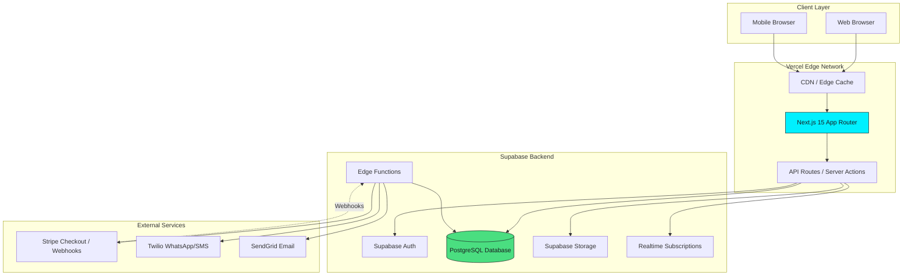

# PARTNERSLLC Fullstack Architecture Document

**Version:** 1.0
**Date:** January 6, 2026
**Project:** PARTNERSLLC - Multi-Product Business Services SaaS Platform
**Status:** Ready for Development

---

## Change Log

| Date | Version | Description | Author |
|------|---------|-------------|--------|
| 2026-01-06 | 1.0 | Initial architecture document | Winston (Architect Agent) |

---

## Introduction

This document outlines the complete fullstack architecture for PARTNERSLLC, a multi-product SaaS platform designed to streamline business service delivery including LLC formation, Dubai company creation, compliance services, accounting, banking, and other structured business services.

### Starter Template or Existing Project

**Greenfield project** with existing UI design prototypes.

**UI Design Reference:** Complete UI prototypes available in `uxpilot-export-1767639162734/` directory with 15 HTML files demonstrating:
- Dark theme design system with exact color specifications
- Client dashboard and dossier tracking interfaces
- Admin portal with analytics, client management, and dossier management
- Login/registration flows
- Document management interfaces
- French language UI

**Design System Constraints:**
- **Color Palette:**
  - Main Background: `#191A1D`
  - Surface: `#2D3033`
  - Border: `#363636`
  - Text Primary: `#F9F9F9`
  - Text Secondary: `#B7B7B7`
  - Accent (Cyan): `#00F0FF`
  - Success (Green): `#4ADE80`
  - Warning (Yellow): `#FACC15`
  - Danger (Red): `#F95757`
- **Typography:** Inter font family from Google Fonts
- **Icons:** Font Awesome 6.4.0
- **Framework:** Tailwind CSS with custom design tokens
- **Language:** French UI (all labels, messages, notifications)

---

## High Level Architecture

### Technical Summary

PARTNERSLLC employs a **serverless monolith architecture** using Next.js 15 App Router with Supabase as Backend-as-a-Service. The platform uses a **single Next.js application** deployed to Vercel with route-based separation for public, client, and admin interfaces. The architecture is designed for **multi-product extensibility**, enabling support for various business services (LLC formation, Dubai company setup, compliance, accounting, banking) through a flexible product catalog system with **configurable workflows**. Each workflow step can be configured by admins to require document uploads, custom form inputs, or both, making the system adaptable to any business service. Supabase provides PostgreSQL database with Row-Level Security, authentication, file storage, and real-time capabilities, while external integrations with Stripe (payments), Twilio (WhatsApp/SMS), and SendGrid (email) enable comprehensive service delivery automation.

### Platform and Infrastructure Choice

**Platform:** Vercel + Supabase

**Key Services:**
- **Vercel:** Next.js hosting, Edge Network CDN, serverless functions, preview deployments, automatic CI/CD
- **Supabase:** PostgreSQL database, Auth (JWT), Storage (S3-compatible), Realtime (WebSocket), Edge Functions (Deno runtime)
- **Stripe:** Payment processing, Checkout Sessions, webhook management
- **Twilio:** WhatsApp Business API, SMS delivery
- **SendGrid:** Transactional email delivery
- **Sentry:** Error tracking and monitoring
- **Vercel Analytics:** Performance monitoring
- **PostHog:** Product analytics and feature flags

**Deployment Host and Regions:**
- Vercel Edge Network (global CDN with automatic routing)
- Supabase EU Central region (GDPR compliance for European clients)
- Stripe Europe instance

### Repository Structure

**Structure:** Single Next.js application (standard structure, no monorepo)

```
partnersllc/
├── src/                        # Application source
│   ├── app/                    # Next.js App Router
│   ├── components/             # React components
│   ├── lib/                    # Utilities, helpers, clients
│   ├── hooks/                  # Custom React hooks
│   ├── stores/                 # Zustand stores
│   └── types/                  # TypeScript types
├── public/                     # Static assets
├── supabase/                   # Supabase migrations, edge functions
└── tests/                      # Test files
```

### High Level Architecture Diagram



### Architectural Patterns

- **Jamstack Architecture:** Static-first with dynamic data fetching via React Server Components and Server Actions - _Rationale:_ Optimal performance through edge caching while maintaining dynamic capabilities

- **Feature-Sliced Design:** Organization by business features (products, dossiers, documents, payments) - _Rationale:_ Improves maintainability and enables independent feature development

- **Server Components First:** Default to React Server Components, use Client Components only when needed - _Rationale:_ Reduces bundle size, improves initial load performance

- **Repository Pattern:** Abstract data access through repositories/services layer using Supabase client - _Rationale:_ Enables testing, provides consistent error handling

- **Event Sourcing (Partial):** Immutable event log for dossier actions alongside mutable state - _Rationale:_ Provides audit trail and timeline

- **Multi-Tenancy:** Single database with tenant isolation via Row-Level Security policies - _Rationale:_ Simplifies deployment while ensuring data isolation

- **Dynamic Form Builder Pattern:** Workflow steps configured with JSON schema for custom input fields - _Rationale:_ Enables admins to create flexible workflows without code changes

---

## Tech Stack

### Technology Stack Table

| Category | Technology | Version | Purpose | Rationale |
|----------|-----------|---------|---------|-----------|
| Frontend Language | TypeScript | 5.3+ | Type-safe frontend development | Prevents runtime errors, better IDE support |
| Frontend Framework | Next.js | 15.x | React framework with App Router | Server Components, Server Actions, optimal Vercel deployment |
| UI Component Library | shadcn/ui | Latest | Accessible component primitives | Radix UI foundation ensures WCAG AA compliance |
| State Management | React Context + Zustand | 4.x | Global state + complex client state | Context for auth/session, Zustand for forms |
| Backend Language | TypeScript | 5.3+ | Type-safe backend logic | Shared types with frontend |
| Backend Framework | Next.js Server Components + Server Actions | 15.x | Server-side logic and API layer | Type-safe APIs, integrated with frontend |
| API Style | Server Actions + REST API Routes | N/A | Client-server communication | Server Actions for mutations, API routes for webhooks |
| Database Client | Supabase JS Client | Latest | Type-safe database access | Native Supabase integration, auto-generated types |
| Database | PostgreSQL | 15+ (Supabase) | Primary data store | ACID compliance, RLS for security, JSONB support |
| File Storage | Supabase Storage | N/A | Document storage with signed URLs | S3-compatible, integrated auth |
| Authentication | Supabase Auth | N/A | JWT-based authentication | Email/password, magic links, RLS integration |
| Form Validation | Zod + React Hook Form | Latest | Type-safe schema validation | Runtime validation matching TypeScript types |
| Dynamic Forms | react-jsonschema-form | Latest | JSON schema-based form rendering | Admin-configurable workflow step inputs |
| Frontend Testing | Vitest + React Testing Library | Latest | Unit and component tests | Fast execution, Next.js compatible |
| E2E Testing | Playwright | Latest | Critical user journey testing | Cross-browser support, auto-waiting |
| Build Tool | Next.js Compiler (SWC) | Built-in | Bundling and compilation | Optimized for Next.js |
| Bundler | Turbopack | Built-in (Next.js 15) | Development bundling | Faster hot reload |
| Package Manager | pnpm | 8.x | Dependency management | Fast, disk-efficient |
| CI/CD | GitHub Actions + Vercel | N/A | Automated testing and deployment | Integrated with Vercel |
| Monitoring | Sentry | Latest | Error tracking and performance | Fullstack error tracking |
| Logging | Axiom | N/A | Application logging | Structured logs, fast search |
| CSS Framework | Tailwind CSS | 3.4+ | Utility-first styling | Matches UI prototypes |

---

## Data Models

### Product

**Purpose:** Represents a business service offering with configurable pricing, workflow steps, and required documents.

**Key Attributes:**
- `id`: uuid - Unique identifier
- `name`: text - Product name
- `slug`: text - URL-friendly identifier
- `category`: enum - Product category
- `description`: text - Full product description
- `price`: integer - Base price in cents
- `currency`: text - ISO currency code
- `is_active`: boolean - Whether product is available
- `metadata`: jsonb - Flexible product configuration

#### TypeScript Interface

```typescript
interface Product {
  id: string;
  name: string;
  slug: string;
  category: 'company_formation' | 'compliance' | 'accounting' | 'banking' | 'other';
  description: string;
  price: number;
  currency: string;
  is_active: boolean;
  metadata: Record<string, any>;
  created_at: string;
  updated_at: string;
}
```

---

### WorkflowStepTemplate

**Purpose:** Defines workflow steps for a product. Each step can require document uploads, custom form inputs, or both. **Admins configure input fields dynamically** using JSON schema.

**Key Attributes:**
- `id`: uuid - Unique identifier
- `product_id`: uuid - Parent product reference
- `step_number`: integer - Sequential order
- `name`: text - Step name
- `description`: text - Step instructions
- `input_schema`: jsonb - **JSON Schema defining custom form inputs**
- `required_documents`: text[] - Required document types
- `auto_complete`: boolean - Auto-complete when requirements met
- `agent_review_required`: boolean - Requires agent review

#### TypeScript Interface

```typescript
interface WorkflowStepTemplate {
  id: string;
  product_id: string;
  step_number: number;
  name: string;
  description: string;
  input_schema: JSONSchema7 | null; // JSON Schema for dynamic fields
  required_documents: string[];
  auto_complete: boolean;
  agent_review_required: boolean;
  created_at: string;
  updated_at: string;
}

// Example input_schema:
const exampleSchema: JSONSchema7 = {
  type: 'object',
  required: ['company_name', 'jurisdiction'],
  properties: {
    company_name: {
      type: 'string',
      title: 'Nom de la société',
      minLength: 1,
    },
    jurisdiction: {
      type: 'string',
      title: 'Juridiction',
      enum: ['Delaware', 'Wyoming', 'Nevada'],
    },
  },
};
```

---

### User

**Key Attributes:**
- `id`: uuid - Unique identifier (matches Supabase Auth)
- `email`: text - Email address
- `full_name`: text - Full name
- `phone`: text - Phone number
- `role`: enum - User role (CLIENT, AGENT, ADMIN)
- `status`: enum - Account status (PENDING, ACTIVE, SUSPENDED)
- `stripe_customer_id`: text - Stripe customer ID
- `notification_preferences`: jsonb - Multi-channel settings
- `metadata`: jsonb - Additional user data

```typescript
interface User {
  id: string;
  email: string;
  full_name: string;
  phone: string | null;
  role: 'CLIENT' | 'AGENT' | 'ADMIN';
  status: 'PENDING' | 'ACTIVE' | 'SUSPENDED';
  stripe_customer_id: string | null;
  notification_preferences: {
    email: boolean;
    whatsapp: boolean;
    sms: boolean;
    in_app: boolean;
  };
  metadata: Record<string, any>;
  created_at: string;
  updated_at: string;
}
```

---

### ServiceDossier

**Key Attributes:**
- `id`: uuid - Unique identifier
- `dossier_number`: text - Human-readable reference
- `user_id`: uuid - Client reference
- `product_id`: uuid - Product being delivered
- `assigned_agent_id`: uuid - Assigned agent
- `status`: enum - Current status
- `current_step_number`: integer - Current workflow step
- `completion_percentage`: integer - Overall progress (0-100)
- `metadata`: jsonb - Product-specific data

```typescript
interface ServiceDossier {
  id: string;
  dossier_number: string;
  user_id: string;
  product_id: string;
  assigned_agent_id: string | null;
  status: 'DRAFT' | 'IN_PROGRESS' | 'REVIEW' | 'COMPLETED' | 'CANCELLED';
  current_step_number: number;
  completion_percentage: number;
  metadata: Record<string, any>;
  created_at: string;
  updated_at: string;
  completed_at: string | null;
}
```

---

### DossierStep

**Key Attributes:**
- `id`: uuid - Unique identifier
- `dossier_id`: uuid - Parent dossier reference
- `step_template_id`: uuid - Workflow step template
- `step_number`: integer - Sequential order
- `status`: enum - Step status
- `input_data`: jsonb - **User-submitted form data**
- `completed_at`: timestamptz - Completion timestamp
- `completed_by_id`: uuid - User who completed

```typescript
interface DossierStep {
  id: string;
  dossier_id: string;
  step_template_id: string;
  step_number: number;
  status: 'PENDING' | 'IN_PROGRESS' | 'COMPLETED' | 'BLOCKED';
  input_data: Record<string, any> | null; // Data from dynamic form
  completed_at: string | null;
  completed_by_id: string | null;
  created_at: string;
  updated_at: string;
}
```

---

### Document

```typescript
interface Document {
  id: string;
  dossier_id: string;
  dossier_step_id: string;
  document_type: string;
  file_name: string;
  file_url: string;
  file_size: number;
  mime_type: string;
  version: number;
  status: 'PENDING' | 'APPROVED' | 'REJECTED' | 'OUTDATED';
  rejection_reason: string | null;
  reviewed_by_id: string | null;
  reviewed_at: string | null;
  uploaded_by_id: string;
  created_at: string;
  updated_at: string;
}
```

---

### Payment, Order, PaymentLink, Notification, Message, DossierEvent

*(TypeScript interfaces similar to above, following same pattern)*

---

## Database Schema

```sql
-- Enable UUID extension
CREATE EXTENSION IF NOT EXISTS "uuid-ossp";

-- ============================================================
-- PRODUCT CATALOG
-- ============================================================

CREATE TABLE products (
  id UUID PRIMARY KEY DEFAULT uuid_generate_v4(),
  name TEXT NOT NULL,
  slug TEXT NOT NULL UNIQUE,
  category TEXT NOT NULL CHECK (category IN ('company_formation', 'compliance', 'accounting', 'banking', 'other')),
  description TEXT NOT NULL,
  price INTEGER NOT NULL,
  currency TEXT NOT NULL DEFAULT 'USD',
  is_active BOOLEAN NOT NULL DEFAULT true,
  metadata JSONB DEFAULT '{}',
  created_at TIMESTAMPTZ NOT NULL DEFAULT NOW(),
  updated_at TIMESTAMPTZ NOT NULL DEFAULT NOW()
);

CREATE TABLE workflow_step_templates (
  id UUID PRIMARY KEY DEFAULT uuid_generate_v4(),
  product_id UUID NOT NULL REFERENCES products(id) ON DELETE CASCADE,
  step_number INTEGER NOT NULL,
  name TEXT NOT NULL,
  description TEXT NOT NULL,
  input_schema JSONB, -- JSON Schema for dynamic form fields
  required_documents TEXT[] NOT NULL DEFAULT '{}',
  auto_complete BOOLEAN NOT NULL DEFAULT false,
  agent_review_required BOOLEAN NOT NULL DEFAULT true,
  created_at TIMESTAMPTZ NOT NULL DEFAULT NOW(),
  updated_at TIMESTAMPTZ NOT NULL DEFAULT NOW(),
  UNIQUE(product_id, step_number)
);

CREATE INDEX idx_workflow_steps_product ON workflow_step_templates(product_id);

-- ============================================================
-- USERS & AUTH
-- ============================================================

CREATE TABLE users (
  id UUID PRIMARY KEY REFERENCES auth.users(id) ON DELETE CASCADE,
  email TEXT NOT NULL UNIQUE,
  full_name TEXT NOT NULL,
  phone TEXT,
  role TEXT NOT NULL CHECK (role IN ('CLIENT', 'AGENT', 'ADMIN')) DEFAULT 'CLIENT',
  status TEXT NOT NULL CHECK (status IN ('PENDING', 'ACTIVE', 'SUSPENDED')) DEFAULT 'PENDING',
  stripe_customer_id TEXT,
  notification_preferences JSONB NOT NULL DEFAULT '{"email": true, "whatsapp": true, "sms": true, "in_app": true}',
  metadata JSONB DEFAULT '{}',
  created_at TIMESTAMPTZ NOT NULL DEFAULT NOW(),
  updated_at TIMESTAMPTZ NOT NULL DEFAULT NOW()
);

CREATE INDEX idx_users_email ON users(email);
CREATE INDEX idx_users_role ON users(role);
CREATE INDEX idx_users_status ON users(status);

-- ============================================================
-- PAYMENT LINKS
-- ============================================================

CREATE TABLE payment_links (
  id UUID PRIMARY KEY DEFAULT uuid_generate_v4(),
  token TEXT NOT NULL UNIQUE,
  product_id UUID NOT NULL REFERENCES products(id) ON DELETE RESTRICT,
  email TEXT NOT NULL,
  expires_at TIMESTAMPTZ NOT NULL,
  max_uses INTEGER NOT NULL DEFAULT 1,
  uses_count INTEGER NOT NULL DEFAULT 0,
  is_active BOOLEAN NOT NULL DEFAULT true,
  metadata JSONB DEFAULT '{}',
  created_by_id UUID NOT NULL REFERENCES users(id),
  created_at TIMESTAMPTZ NOT NULL DEFAULT NOW(),
  updated_at TIMESTAMPTZ NOT NULL DEFAULT NOW()
);

CREATE INDEX idx_payment_links_token ON payment_links(token);

-- ============================================================
-- ORDERS & PAYMENTS
-- ============================================================

CREATE TABLE orders (
  id UUID PRIMARY KEY DEFAULT uuid_generate_v4(),
  user_id UUID NOT NULL REFERENCES users(id) ON DELETE RESTRICT,
  product_id UUID NOT NULL REFERENCES products(id) ON DELETE RESTRICT,
  total_amount INTEGER NOT NULL,
  currency TEXT NOT NULL DEFAULT 'USD',
  status TEXT NOT NULL CHECK (status IN ('pending', 'paid', 'failed', 'refunded')) DEFAULT 'pending',
  dossier_id UUID,
  created_at TIMESTAMPTZ NOT NULL DEFAULT NOW(),
  updated_at TIMESTAMPTZ NOT NULL DEFAULT NOW()
);

CREATE TABLE payments (
  id UUID PRIMARY KEY DEFAULT uuid_generate_v4(),
  order_id UUID NOT NULL REFERENCES orders(id) ON DELETE RESTRICT,
  stripe_payment_intent_id TEXT,
  stripe_checkout_session_id TEXT NOT NULL UNIQUE,
  amount INTEGER NOT NULL,
  currency TEXT NOT NULL DEFAULT 'USD',
  status TEXT NOT NULL CHECK (status IN ('pending', 'processing', 'succeeded', 'failed', 'cancelled')) DEFAULT 'pending',
  metadata JSONB DEFAULT '{}',
  created_at TIMESTAMPTZ NOT NULL DEFAULT NOW(),
  updated_at TIMESTAMPTZ NOT NULL DEFAULT NOW()
);

CREATE INDEX idx_orders_user ON orders(user_id);
CREATE INDEX idx_payments_order ON payments(order_id);

-- ============================================================
-- SERVICE DOSSIERS & WORKFLOW
-- ============================================================

CREATE TABLE service_dossiers (
  id UUID PRIMARY KEY DEFAULT uuid_generate_v4(),
  dossier_number TEXT NOT NULL UNIQUE,
  user_id UUID NOT NULL REFERENCES users(id) ON DELETE RESTRICT,
  product_id UUID NOT NULL REFERENCES products(id) ON DELETE RESTRICT,
  assigned_agent_id UUID REFERENCES users(id) ON DELETE SET NULL,
  status TEXT NOT NULL CHECK (status IN ('DRAFT', 'IN_PROGRESS', 'REVIEW', 'COMPLETED', 'CANCELLED')) DEFAULT 'IN_PROGRESS',
  current_step_number INTEGER NOT NULL DEFAULT 1,
  completion_percentage INTEGER NOT NULL DEFAULT 0 CHECK (completion_percentage BETWEEN 0 AND 100),
  metadata JSONB DEFAULT '{}',
  created_at TIMESTAMPTZ NOT NULL DEFAULT NOW(),
  updated_at TIMESTAMPTZ NOT NULL DEFAULT NOW(),
  completed_at TIMESTAMPTZ
);

CREATE TABLE dossier_steps (
  id UUID PRIMARY KEY DEFAULT uuid_generate_v4(),
  dossier_id UUID NOT NULL REFERENCES service_dossiers(id) ON DELETE CASCADE,
  step_template_id UUID NOT NULL REFERENCES workflow_step_templates(id) ON DELETE RESTRICT,
  step_number INTEGER NOT NULL,
  status TEXT NOT NULL CHECK (status IN ('PENDING', 'IN_PROGRESS', 'COMPLETED', 'BLOCKED')) DEFAULT 'PENDING',
  input_data JSONB, -- User-submitted form data
  completed_at TIMESTAMPTZ,
  completed_by_id UUID REFERENCES users(id),
  created_at TIMESTAMPTZ NOT NULL DEFAULT NOW(),
  updated_at TIMESTAMPTZ NOT NULL DEFAULT NOW(),
  UNIQUE(dossier_id, step_number)
);

CREATE INDEX idx_dossiers_user ON service_dossiers(user_id);
CREATE INDEX idx_dossiers_agent ON service_dossiers(assigned_agent_id);
CREATE INDEX idx_dossier_steps_dossier ON dossier_steps(dossier_id);

-- ============================================================
-- DOCUMENTS
-- ============================================================

CREATE TABLE documents (
  id UUID PRIMARY KEY DEFAULT uuid_generate_v4(),
  dossier_id UUID NOT NULL REFERENCES service_dossiers(id) ON DELETE CASCADE,
  dossier_step_id UUID NOT NULL REFERENCES dossier_steps(id) ON DELETE CASCADE,
  document_type TEXT NOT NULL,
  file_name TEXT NOT NULL,
  file_url TEXT NOT NULL,
  file_size INTEGER NOT NULL,
  mime_type TEXT NOT NULL,
  version INTEGER NOT NULL DEFAULT 1,
  status TEXT NOT NULL CHECK (status IN ('PENDING', 'APPROVED', 'REJECTED', 'OUTDATED')) DEFAULT 'PENDING',
  rejection_reason TEXT,
  reviewed_by_id UUID REFERENCES users(id),
  reviewed_at TIMESTAMPTZ,
  uploaded_by_id UUID NOT NULL REFERENCES users(id),
  created_at TIMESTAMPTZ NOT NULL DEFAULT NOW(),
  updated_at TIMESTAMPTZ NOT NULL DEFAULT NOW()
);

CREATE INDEX idx_documents_dossier ON documents(dossier_id);
CREATE INDEX idx_documents_status ON documents(status);

-- ============================================================
-- EVENTS & TIMELINE
-- ============================================================

CREATE TABLE dossier_events (
  id UUID PRIMARY KEY DEFAULT uuid_generate_v4(),
  dossier_id UUID NOT NULL REFERENCES service_dossiers(id) ON DELETE CASCADE,
  event_type TEXT NOT NULL,
  description TEXT NOT NULL,
  actor_id UUID REFERENCES users(id),
  metadata JSONB DEFAULT '{}',
  created_at TIMESTAMPTZ NOT NULL DEFAULT NOW()
);

CREATE INDEX idx_events_dossier ON dossier_events(dossier_id);

-- ============================================================
-- NOTIFICATIONS
-- ============================================================

CREATE TABLE notifications (
  id UUID PRIMARY KEY DEFAULT uuid_generate_v4(),
  user_id UUID NOT NULL REFERENCES users(id) ON DELETE CASCADE,
  type TEXT NOT NULL,
  title TEXT NOT NULL,
  message TEXT NOT NULL,
  channels TEXT[] NOT NULL DEFAULT '{}',
  delivery_status JSONB NOT NULL DEFAULT '{}',
  is_read BOOLEAN NOT NULL DEFAULT false,
  related_dossier_id UUID REFERENCES service_dossiers(id) ON DELETE SET NULL,
  created_at TIMESTAMPTZ NOT NULL DEFAULT NOW(),
  updated_at TIMESTAMPTZ NOT NULL DEFAULT NOW()
);

CREATE INDEX idx_notifications_user ON notifications(user_id);

-- ============================================================
-- MESSAGES
-- ============================================================

CREATE TABLE messages (
  id UUID PRIMARY KEY DEFAULT uuid_generate_v4(),
  dossier_id UUID NOT NULL REFERENCES service_dossiers(id) ON DELETE CASCADE,
  sender_id UUID NOT NULL REFERENCES users(id) ON DELETE RESTRICT,
  content TEXT NOT NULL,
  attachments JSONB DEFAULT '[]',
  is_read BOOLEAN NOT NULL DEFAULT false,
  created_at TIMESTAMPTZ NOT NULL DEFAULT NOW(),
  updated_at TIMESTAMPTZ NOT NULL DEFAULT NOW()
);

CREATE INDEX idx_messages_dossier ON messages(dossier_id);

-- ============================================================
-- ROW-LEVEL SECURITY POLICIES
-- ============================================================

ALTER TABLE users ENABLE ROW LEVEL SECURITY;
ALTER TABLE service_dossiers ENABLE ROW LEVEL SECURITY;
ALTER TABLE dossier_steps ENABLE ROW LEVEL SECURITY;
ALTER TABLE documents ENABLE ROW LEVEL SECURITY;
ALTER TABLE messages ENABLE ROW LEVEL SECURITY;
ALTER TABLE notifications ENABLE ROW LEVEL SECURITY;

-- Users can view their own profile
CREATE POLICY "Users can view own profile"
  ON users FOR SELECT
  USING (auth.uid() = id);

-- Clients can view their own dossiers
CREATE POLICY "Users can view own dossiers"
  ON service_dossiers FOR SELECT
  USING (
    auth.uid() = user_id
    OR auth.uid() = assigned_agent_id
    OR EXISTS (SELECT 1 FROM users WHERE id = auth.uid() AND role IN ('AGENT', 'ADMIN'))
  );

-- ============================================================
-- FUNCTIONS & TRIGGERS
-- ============================================================

-- Auto-update updated_at timestamp
CREATE OR REPLACE FUNCTION update_updated_at_column()
RETURNS TRIGGER AS $$
BEGIN
  NEW.updated_at = NOW();
  RETURN NEW;
END;
$$ LANGUAGE plpgsql;

CREATE TRIGGER update_users_updated_at BEFORE UPDATE ON users
  FOR EACH ROW EXECUTE FUNCTION update_updated_at_column();

CREATE TRIGGER update_dossiers_updated_at BEFORE UPDATE ON service_dossiers
  FOR EACH ROW EXECUTE FUNCTION update_updated_at_column();
```

---

## API Specification

### Server Actions (Mutations)

```typescript
// src/app/actions/dossier-actions.ts
'use server';

import { createServerClient } from '@/lib/supabase/server';
import { revalidatePath } from 'next/cache';
import { z } from 'zod';

const submitStepInputSchema = z.object({
  dossier_id: z.string().uuid(),
  step_id: z.string().uuid(),
  input_data: z.record(z.any()),
});

export async function submitStepInput(formData: FormData) {
  const supabase = createServerClient();

  // Validate session
  const { data: { user } } = await supabase.auth.getUser();
  if (!user) throw new Error('Unauthorized');

  // Validate input
  const data = submitStepInputSchema.parse({
    dossier_id: formData.get('dossier_id'),
    step_id: formData.get('step_id'),
    input_data: JSON.parse(formData.get('input_data') as string),
  });

  // Update step with input data
  const { error } = await supabase
    .from('dossier_steps')
    .update({
      input_data: data.input_data,
      status: 'COMPLETED',
      completed_at: new Date().toISOString(),
      completed_by_id: user.id,
    })
    .eq('id', data.step_id);

  if (error) throw error;

  // Create event
  await supabase.from('dossier_events').insert({
    dossier_id: data.dossier_id,
    event_type: 'step_input_submitted',
    description: 'Client submitted step input',
    actor_id: user.id,
    metadata: { step_id: data.step_id },
  });

  revalidatePath(`/dashboard/dossiers/${data.dossier_id}`);

  return { success: true };
}
```

### API Routes (Webhooks)

```typescript
// src/app/api/webhooks/stripe/route.ts

import { NextRequest, NextResponse } from 'next/server';
import Stripe from 'stripe';
import { createClient } from '@supabase/supabase-js';
import { headers } from 'next/headers';

const stripe = new Stripe(process.env.STRIPE_SECRET_KEY!, {
  apiVersion: '2023-10-16',
});

const supabase = createClient(
  process.env.NEXT_PUBLIC_SUPABASE_URL!,
  process.env.SUPABASE_SERVICE_ROLE_KEY!
);

export async function POST(req: NextRequest) {
  const body = await req.text();
  const signature = headers().get('stripe-signature');

  let event: Stripe.Event;

  try {
    event = stripe.webhooks.constructEvent(
      body,
      signature!,
      process.env.STRIPE_WEBHOOK_SECRET!
    );
  } catch (err) {
    return NextResponse.json({ error: 'Invalid signature' }, { status: 400 });
  }

  if (event.type === 'checkout.session.completed') {
    const session = event.data.object as Stripe.Checkout.Session;

    // Update order
    await supabase
      .from('orders')
      .update({ status: 'paid' })
      .eq('id', session.metadata!.order_id);

    // Create dossier
    // ... implementation
  }

  return NextResponse.json({ received: true });
}
```

---

## Components

### Dynamic Form Renderer

**Responsibility:** Renders forms dynamically based on JSON Schema defined in WorkflowStepTemplate.

```typescript
// src/components/features/dossiers/dynamic-form-renderer.tsx
'use client';

import Form from '@rjsf/core';
import validator from '@rjsf/validator-ajv8';
import { JSONSchema7 } from 'json-schema';

interface DynamicFormRendererProps {
  schema: JSONSchema7;
  onSubmit: (data: Record<string, any>) => Promise<void>;
}

export function DynamicFormRenderer({ schema, onSubmit }: DynamicFormRendererProps) {
  return (
    <Form
      schema={schema}
      validator={validator}
      onSubmit={({ formData }) => onSubmit(formData)}
      uiSchema={{
        'ui:submitButtonOptions': {
          submitText: 'Suivant',
        },
      }}
    />
  );
}
```

---

## Unified Project Structure

```
partnersllc/
├── src/
│   ├── app/                          # Next.js App Router
│   │   ├── (public)/                 # Public routes
│   │   │   ├── register/[token]/page.tsx
│   │   │   ├── login/page.tsx
│   │   │   └── layout.tsx
│   │   ├── (client)/                 # Client routes
│   │   │   ├── dashboard/
│   │   │   │   ├── page.tsx
│   │   │   │   └── dossiers/[id]/page.tsx
│   │   │   └── layout.tsx
│   │   ├── (admin)/                  # Admin routes
│   │   │   ├── dashboard/page.tsx
│   │   │   ├── products/page.tsx
│   │   │   ├── reviews/page.tsx
│   │   │   └── layout.tsx
│   │   ├── api/
│   │   │   └── webhooks/stripe/route.ts
│   │   ├── actions/                  # Server Actions
│   │   │   ├── dossier-actions.ts
│   │   │   └── document-actions.ts
│   │   └── layout.tsx
│   ├── components/
│   │   ├── ui/                       # shadcn/ui primitives
│   │   ├── features/
│   │   │   ├── dossiers/
│   │   │   │   ├── dynamic-form-renderer.tsx
│   │   │   │   └── dossier-card.tsx
│   │   │   └── admin/
│   │   │       └── workflow-step-editor.tsx
│   │   └── layouts/
│   ├── lib/
│   │   ├── supabase/
│   │   │   ├── client.ts             # Supabase client
│   │   │   └── server.ts             # Supabase server client
│   │   ├── stripe.ts
│   │   ├── utils.ts
│   │   └── validations.ts
│   ├── hooks/
│   ├── stores/
│   ├── types/
│   └── styles/globals.css
├── public/
├── supabase/
│   ├── migrations/
│   │   └── 20260106_initial_schema.sql
│   └── functions/
│       ├── send-notifications/
│       └── payment-reminders/
├── tests/
├── .env.example
├── next.config.js
├── tailwind.config.ts
├── tsconfig.json
└── package.json
```

---

## Development Workflow

### Initial Setup

```bash
# Install dependencies
pnpm install

# Set up environment
cp .env.example .env.local

# Start Supabase locally
supabase start

# Run migrations
supabase db push

# Start dev server
pnpm dev
```

### Dev Commands

```bash
# Development
pnpm dev

# Database
supabase migration new <name>
supabase db push
supabase db reset

# Testing
pnpm test
pnpm test:e2e

# Build
pnpm build
```

---

## Security and Performance

### Security
- Row-Level Security on all tables
- Input validation with Zod
- Signed URLs for file storage
- HTTP-only cookies for auth

### Performance
- Server Components by default
- Bundle size < 200KB
- Database indexes on foreign keys
- Edge caching via Vercel

---

## Monitoring

- **Frontend:** Vercel Analytics
- **Backend:** Supabase Dashboard
- **Errors:** Sentry
- **Analytics:** PostHog

---

**Document Status:** Complete and ready for development ✅
**Next Step:** Begin Epic 1 implementation
