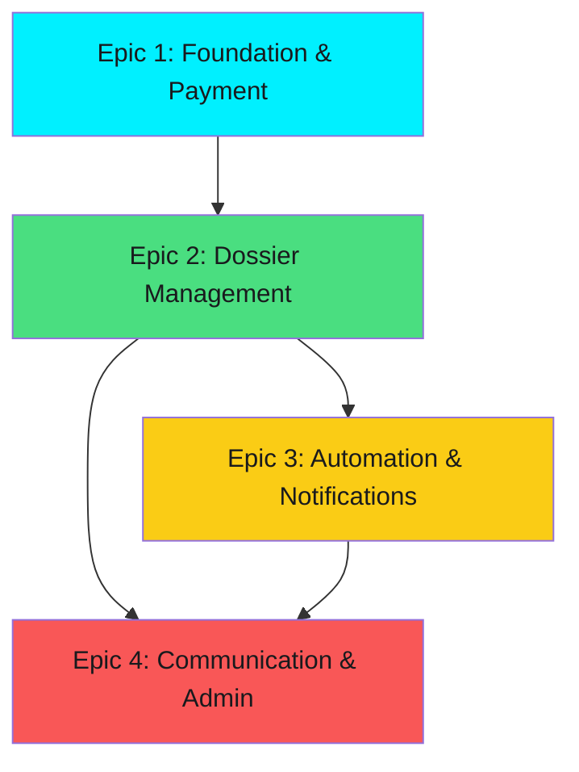

# PARTNERSLLC - Sprint Plan
**Version:** 1.0
**Date:** 2026-01-07
**Scrum Master:** Bob
**Durée de Sprint:** 2 semaines
**Total Sprints:** 6 sprints (12 semaines)

---

## Vue d'Ensemble du Plan

### Objectif Global
Livrer une plateforme SaaS complète pour la gestion de services business (formation LLC, création d'entreprise Dubai, etc.) avec automatisation des paiements, gestion des dossiers, workflow de documents et communication multi-canal.

### Métriques Clés
- **Total Stories:** 31 stories réparties sur 4 épics
- **Vélocité Estimée:** 5-6 stories par sprint
- **Timeline:** 12 semaines (6 sprints de 2 semaines)
- **Release Plan:** Déploiement incrémental après chaque epic

### Stratégie de Delivery
Chaque sprint livre de la valeur déployable:
- **Sprints 0-1:** Infrastructure + Conversion client (paiement)
- **Sprints 2-3:** Workflow dossier complet (client + agent)
- **Sprints 4-5:** Automation et communication
- **Sprint 6:** Outils admin et analytics

---

## Sprint 0: Foundation & Infrastructure
**Durée:** 2 semaines
**Epic:** Epic 1 - Foundation (Partie 1)

### Objectif de Sprint
✅ Établir une base technique solide avec Next.js, Supabase, authentification et validation de l'infrastructure déployable.

### Stories Incluses
| Story | Titre | Complexité | Dépendances |
|-------|-------|------------|-------------|
| 1.1 | Project Initialization | M | Aucune |
| 1.2 | Database Schema | L | 1.1 |
| 1.3 | Authentication System | M | 1.1, 1.2 |
| 1.4 | Health Check & Deployment | S | 1.1, 1.2, 1.3 |

**Complexité:** S=Petit (1-2j), M=Moyen (3-4j), L=Large (5-7j)

### Valeur Business
- Infrastructure déployée sur Vercel + Supabase
- Authentification sécurisée fonctionnelle
- Base de données avec RLS activée
- Endpoint de santé pour monitoring

### Critères de Succès Sprint
- [ ] Application Next.js déployée sur Vercel avec CI/CD
- [ ] Base de données Supabase avec 21 tables + RLS + triggers
- [ ] Login/logout fonctionnel avec Supabase Auth
- [ ] `/api/health` retourne "healthy" en production
- [ ] Tests E2E pour auth passent à 100%

### Risques Identifiés
| Risque | Impact | Probabilité | Mitigation |
|--------|--------|-------------|------------|
| Problèmes de déploiement Vercel/Supabase | Élevé | Faible | Setup early, test deployment jour 1 |
| Complexité du schéma DB (21 tables) | Moyen | Moyen | Validation avec architect, migration incrémentale |
| Configuration RLS complexe | Moyen | Moyen | Tests unitaires pour chaque policy |

### Définition de "Done"
- Code merged dans main
- Tests passent (unit + integration + E2E)
- Déployé en staging avec health check green
- Documentation README à jour

---

## Sprint 1: Core Payment Flow
**Durée:** 2 semaines
**Epic:** Epic 1 - Foundation (Partie 2)

### Objectif de Sprint
💰 **Livrer le flow complet de conversion client**: génération de payment links → inscription → paiement Stripe → activation compte automatique.

### Stories Incluses
| Story | Titre | Complexité | Dépendances |
|-------|-------|------------|-------------|
| 1.5 | Stripe Integration Setup | M | 1.1 |
| 1.6 | Payment Link Generation | M | 1.2, 1.3, 1.5 |
| 1.7 | Registration Page | L | 1.2, 1.3, 1.5, 1.6 |
| 1.8 | Stripe Checkout Integration | M | 1.5, 1.7 |
| 1.9 | Webhook Handler | L | 1.2, 1.5, 1.8 |
| 1.10 | User Status Management | M | 1.3, 1.9 |

### Valeur Business
🎯 **Valeur Critique:** Premier flow générant du revenue!
- Admin peut générer des payment links personnalisés
- Prospects s'inscrivent + paient en un seul flow
- Webhook Stripe active automatiquement les comptes
- Dossiers créés automatiquement après paiement

### Critères de Succès Sprint
- [ ] Admin génère payment link depuis `/admin/payment-links`
- [ ] Prospect clique le lien → complète registration + paiement Stripe
- [ ] Webhook Stripe crée dossier + active compte (status ACTIVE)
- [ ] Client accède dashboard avec dossier créé
- [ ] Test E2E: payment link → registration → checkout → webhook → dashboard

### Risques Identifiés
| Risque | Impact | Probabilité | Mitigation |
|--------|--------|-------------|------------|
| Stripe webhook idempotence failures | Élevé | Moyen | Implement retry logic + idempotency checks |
| Race conditions (webhook + user login) | Moyen | Moyen | Use database transactions |
| Test mode Stripe configuration | Faible | Faible | Document test cards, use Stripe CLI |

### Demo Scenario
1. Admin crée payment link pour "LLC Formation - $999"
2. Prospect reçoit email avec lien unique
3. Prospect s'inscrit (nom, phone, password) + redirigé Stripe
4. Paiement avec carte test 4242...
5. Webhook active compte + crée dossier
6. Client se connecte → voit son dossier "LLC Formation"

---

## Sprint 2: Client Dossier Management
**Durée:** 2 semaines
**Epic:** Epic 2 - Dossier Management (Partie 1)

### Objectif de Sprint
📋 **Livrer l'interface client complète**: dashboard dossiers, vue détail, upload de documents avec versioning.

### Stories Incluses
| Story | Titre | Complexité | Dépendances |
|-------|-------|------------|-------------|
| 2.1 | Client Dashboard - Dossier List | M | Epic 1 complet |
| 2.2 | Dossier Detail Page | M | 2.1 |
| 2.3 | Document Upload & Versioning | L | 2.2 |

### Valeur Business
- Clients voient tous leurs dossiers avec statut/progression
- Vue détaillée par dossier avec steps et timeline
- Upload de documents (PDF, images) avec versioning automatique
- Intégration Supabase Storage avec signed URLs

### Critères de Succès Sprint
- [ ] Dashboard `/dashboard` liste tous les dossiers client avec progress bars
- [ ] Page `/dashboard/dossiers/{id}` affiche steps, documents, timeline
- [ ] Client peut drag & drop documents (max 10MB)
- [ ] Upload crée nouvelle version si document rejeté
- [ ] Anciennes versions marquées "OUTDATED"

### Risques Identifiés
| Risque | Impact | Probabilité | Mitigation |
|--------|--------|-------------|------------|
| Performance upload gros fichiers | Moyen | Moyen | Implement chunked upload, progress indicator |
| Gestion versioning complexe | Moyen | Faible | Clear business rules, unit tests |
| Signed URLs expiration issues | Faible | Faible | 1-hour expiry, refresh mechanism |

### Design System Constraints
**Référence:** `uxpilot-export-1767639162734/` - UI prototypes HTML
- Dark theme: Background `#191A1D`, Surface `#2D3033`
- Accent cyan `#00F0FF` pour actions primaires
- Status badges: Green (approved), Yellow (pending), Red (rejected)
- **Langue:** Toutes les labels en français

---

## Sprint 3: Agent Review Workflow
**Durée:** 2 semaines
**Epic:** Epic 2 - Dossier Management (Partie 2)

### Objectif de Sprint
✅ **Compléter le workflow agent**: file d'attente de review, approbation/rejet documents, gestion des rejets, completion des steps.

### Stories Incluses
| Story | Titre | Complexité | Dépendances |
|-------|-------|------------|-------------|
| 2.4 | Agent Review Queue | M | 2.3 |
| 2.5 | Document Review & Approval | L | 2.4 |
| 2.6 | Rejected Document Handling | M | 2.5 |
| 2.7 | Workflow Step Completion | L | 2.5, 2.6 |

### Valeur Business
🎯 **Workflow Complet Opérationnel!**
- Agents voient tous les documents pending review dans une file centralisée
- Review avec preview (PDF, images) + approve/reject + raisons
- Documents rejetés notifient client, permettent re-upload
- Steps se complètent automatiquement quand tous docs approuvés

### Critères de Succès Sprint
- [ ] `/admin/reviews` affiche table triable de documents pending
- [ ] Agent clique document → modal full-screen avec preview + actions
- [ ] Reject demande raison obligatoire
- [ ] Client notifié de rejet (in-app pour MVP, emails dans Epic 3)
- [ ] Step status → COMPLETED quand tous docs APPROVED
- [ ] Dossier avance automatiquement au step suivant

### Risques Identifiés
| Risque | Impact | Probabilité | Mitigation |
|--------|--------|-------------|------------|
| PDF preview performance | Moyen | Moyen | Use PDF.js with lazy loading |
| Step completion logic bugs | Élevé | Moyen | Comprehensive unit tests, state machine |
| Concurrency (2 agents review same doc) | Moyen | Faible | Optimistic locking, database constraints |

### Demo Scenario
1. Client upload "Passport.pdf" pour Step 1
2. Agent voit dans review queue, clique, preview PDF
3. Agent reject: "Photo floue, merci de re-soumettre"
4. Client voit notification, upload nouvelle version
5. Agent approve
6. Step 1 → COMPLETED, dossier avance Step 2

---

## Sprint 4: Event Architecture & Multi-Channel Notifications
**Durée:** 2 semaines
**Epic:** Epic 3 - Workflow Automation (Partie 1)

### Objectif de Sprint
🔔 **Implémenter event-driven architecture + notifications Email/WhatsApp/SMS/In-App** pour automatiser la communication.

### Stories Incluses
| Story | Titre | Complexité | Dépendances |
|-------|-------|------------|-------------|
| 3.1 | Event-Driven Architecture | L | Epic 2 complet |
| 3.2 | Email Notification Delivery | M | 3.1 |
| 3.3 | WhatsApp Notification | M | 3.1 |
| 3.4 | SMS Notification | M | 3.1 |
| 3.5 | In-App Notification System | M | 3.1 |

### Valeur Business
🚀 **Automation Majeure!**
- Tous les événements importants loggés (dossier créé, doc uploadé, step complété, etc.)
- Notifications automatiques multi-canal (Email via SendGrid, WhatsApp via Twilio, SMS via Twilio, In-App via Supabase Realtime)
- Clients et agents informés en temps réel sans intervention manuelle
- Retry logic avec exponential backoff pour deliveries failed

### Critères de Succès Sprint
- [ ] Trigger database créent events automatiquement (via Epic 2 modifications)
- [ ] Supabase Edge Function "send-notifications" traite queue events
- [ ] Email envoyé via SendGrid pour: dossier créé, doc rejeté, step complété
- [ ] WhatsApp envoyé via Twilio Business API
- [ ] SMS envoyé via Twilio
- [ ] In-app notifications apparaissent en temps réel (Realtime subscription)
- [ ] Delivery status trackable dans table `notifications`

### Risques Identifiés
| Risque | Impact | Probabilité | Mitigation |
|--------|--------|-------------|------------|
| Twilio WhatsApp Business approval lent | Élevé | Moyen | Start application early, use sandbox fallback |
| SendGrid deliverability issues | Moyen | Faible | Configure SPF/DKIM, use verified domain |
| Edge Function cold starts | Faible | Moyen | Keep-alive pings, async processing |

### Intégrations Externes
- **SendGrid** (Email): API key configuration
- **Twilio** (WhatsApp + SMS): Account SID, Auth Token, WhatsApp number
- **Supabase Realtime** (In-App): WebSocket subscriptions

---

## Sprint 5: Workflow Automation & Real-Time Communication
**Durée:** 2 semaines
**Epic:** Epic 3 (Partie 2) + Epic 4 (Partie 1)

### Objectif de Sprint
🤖 **Compléter l'automation + lancer la messagerie temps réel** entre clients et agents.

### Stories Incluses
| Story | Titre | Complexité | Dépendances |
|-------|-------|------------|-------------|
| 3.6 | Automated Workflow Step Completion | M | 3.1, 2.7 |
| 3.7 | Suspended User Payment Recovery | L | 3.1, 1.10 |
| 4.1 | Real-Time Messaging | L | Epic 2 complet |
| 4.2 | Agent Dashboard Metrics | M | Epic 2 complet |
| 4.3 | Enhanced Agent Dossier Management | M | 4.2 |
| 4.4 | Bulk Document Review | M | 2.5 |

### Valeur Business
💬 **Communication Bidirectionnelle + Efficiency Agents!**
- Steps se complètent automatiquement quand conditions remplies
- Users SUSPENDED reçoivent reminders automatiques tous les 3 jours
- Messagerie temps réel client ↔ agent dans contexte dossier
- Agent dashboard avec métriques (pending reviews, dossiers actifs)
- Bulk actions pour reviewer plusieurs docs en une fois

### Critères de Succès Sprint
- [ ] Step auto-completion: docs approved → step COMPLETED → avance step suivant
- [ ] Cron job (Supabase Edge Function) envoie payment reminders SUSPENDED users
- [ ] Messagerie `/dashboard/dossiers/{id}` avec thread temps réel
- [ ] Agent dashboard `/admin/dashboard` affiche stats cards
- [ ] Bulk review: select multiple docs → approve/reject all
- [ ] Realtime updates via Supabase subscriptions (no page refresh)

### Risques Identifiés
| Risque | Impact | Probabilité | Mitigation |
|--------|--------|-------------|------------|
| Realtime scalability (100+ concurrent users) | Moyen | Faible | Supabase handles this, but monitor connections |
| Cron job reliability | Moyen | Faible | Logging, alerting, manual trigger backup |
| Bulk operations timeout | Faible | Moyen | Batch processing, progress indicators |

### Demo Scenario - Messaging
1. Client dans dossier pose question: "Quel format pour le passport?"
2. Agent voit message en temps réel dans inbox
3. Agent répond: "PDF ou JPG, max 10MB"
4. Client voit réponse instantanément sans refresh

---

## Sprint 6: Admin Tools & Analytics
**Durée:** 2 semaines
**Epic:** Epic 4 - Communication & Agent Efficiency (Partie 2)

### Objectif de Sprint
📊 **Finaliser les outils admin**: gestion produits/workflows, analytics payment links, dashboard analytics global.

### Stories Incluses
| Story | Titre | Complexité | Dépendances |
|-------|-------|------------|-------------|
| 4.5 | Admin Product Management | L | Epic 1 complet |
| 4.6 | Admin Payment Link Analytics | M | 1.6 |
| 4.7 | Admin Analytics Dashboard | L | Tous les epics |

### Valeur Business
🎯 **Platform Complète pour Business Ops!**
- Admins créent/modifient produits + workflow steps avec custom form inputs (JSON Schema)
- Analytics payment links: conversion rates, usage tracking
- Dashboard analytics global: revenue, dossiers complétés, performance agents
- **MVP Complet Prêt pour Production!**

### Critères de Succès Sprint
- [ ] `/admin/products` - CRUD produits avec pricing
- [ ] Workflow step editor avec JSON Schema builder pour custom inputs
- [ ] Test: admin crée nouveau produit "Dubai Company - $1,499" avec 5 steps
- [ ] `/admin/payment-links` - analytics: links générés, utilisés, expirés, conversion rate
- [ ] `/admin/analytics` - charts: revenue over time, completion rates, agent leaderboard
- [ ] E2E test: admin crée produit → génère link → client achète → agent review → completion

### Risques Identifiés
| Risque | Impact | Probabilité | Mitigation |
|--------|--------|-------------|------------|
| JSON Schema editor UX complexe | Moyen | Moyen | Use react-jsonschema-form with UI improvements |
| Analytics queries performance | Moyen | Faible | Database indexes, caching layer |
| Multi-product testing | Faible | Faible | Comprehensive test data seeding |

### MVP Completion Criteria
- [ ] ✅ All 31 stories completed and deployed
- [ ] ✅ E2E tests pass for all critical flows
- [ ] ✅ Performance: page load < 2s, API < 500ms
- [ ] ✅ Security: RLS validated, Stripe webhooks verified
- [ ] ✅ Documentation: README, API docs, deployment guide
- [ ] ✅ Production deployment with monitoring active

---

## Dépendances Cross-Epic

**Chemin Critique:**
1. Epic 1 (Sprints 0-1) → **BLOQUANT** pour tous les autres
2. Epic 2 (Sprints 2-3) → **BLOQUANT** pour Epic 3 et 4
3. Epic 3 & 4 → **PARALLÉLISABLES** partiellement

---

## Métriques de Vélocité

### Vélocité Prévue par Sprint
| Sprint | Stories | Story Points | Complexité Moyenne |
|--------|---------|--------------|-------------------|
| Sprint 0 | 4 | 13 | Moyen-Élevé (infra setup) |
| Sprint 1 | 6 | 18 | Élevé (payment flow critique) |
| Sprint 2 | 3 | 9 | Moyen (UI client) |
| Sprint 3 | 4 | 14 | Élevé (workflow logic) |
| Sprint 4 | 5 | 15 | Moyen-Élevé (integrations) |
| Sprint 5 | 6 | 17 | Élevé (realtime + automation) |
| Sprint 6 | 3 | 12 | Moyen-Élevé (analytics) |
| **Total** | **31** | **98** | **Moyen-Élevé** |

**Story Points:**
- S (Small): 1-2 points
- M (Medium): 3-5 points
- L (Large): 8-13 points

---

## Release Plan

### Release 1.0 - MVP Launch (Fin Sprint 6)
**Date Cible:** 12 semaines après kick-off
**Scope:** 31 stories, 4 epics complets

**Fonctionnalités Livrées:**
✅ Payment link generation + registration + Stripe checkout
✅ Dossier management avec workflow steps configurable
✅ Document upload/versioning + agent review
✅ Notifications multi-canal (Email, WhatsApp, SMS, In-App)
✅ Real-time messaging client ↔ agent
✅ Admin tools (products, workflows, analytics)
✅ Automated step completion + payment recovery

**Production Readiness Checklist:**
- [ ] Security audit (RLS, signed URLs, webhooks)
- [ ] Performance testing (load testing avec 1000+ users)
- [ ] Monitoring setup (Sentry, Vercel Analytics, PostHog)
- [ ] Backup/recovery tested (Supabase backups)
- [ ] GDPR compliance validated
- [ ] Support documentation (user guides, agent training)

### Post-MVP Roadmap (Hors Scope Sprint Plan)
**Phase 2 - Scalability & UX:**
- Mobile apps (iOS/Android) pour push notifications
- Advanced analytics (funnel analysis, cohort reports)
- Multi-tenant white-label capability
- AI-powered document review assistance

**Phase 3 - Product Expansion:**
- Subscription-based products (recurring billing)
- API pour intégrations tierces
- Workflow automation builder (no-code)
- Advanced agent collaboration tools

---

## Risques Globaux du Projet

### Risques Techniques
| Risque | Impact | Probabilité | Mitigation | Owner |
|--------|--------|-------------|------------|-------|
| Supabase RLS performance à grande échelle | Élevé | Moyen | Benchmark early, optimize queries, indexes | Dev Lead |
| Stripe webhook reliability | Élevé | Faible | Idempotency, retry logic, monitoring, manual fallback | Backend Dev |
| Realtime scalability issues | Moyen | Faible | Connection pooling, Supabase monitoring, fallback polling | Frontend Dev |
| Edge Function cold starts | Faible | Moyen | Keep-alive pings, async queue processing | DevOps |

### Risques Business
| Risque | Impact | Probabilité | Mitigation | Owner |
|--------|--------|-------------|------------|-------|
| Twilio WhatsApp approval delays | Élevé | Moyen | Start early, use sandbox, fallback to SMS/Email | PM |
| Payment processing fees ROI | Moyen | Faible | Model pricing to include Stripe fees (2.9% + 30¢) | Finance |
| User adoption of multi-step workflow | Moyen | Moyen | Clear UX, progress indicators, support docs | UX/PM |

### Risques Organisationnels
| Risque | Impact | Probabilité | Mitigation | Owner |
|--------|--------|-------------|------------|-------|
| Resource availability (dev turnover) | Élevé | Faible | Documentation, knowledge sharing, pair programming | Scrum Master |
| Scope creep from stakeholders | Moyen | Élevé | Strict backlog prioritization, change control process | PM |
| Timeline pressure (12 weeks aggressive) | Moyen | Moyen | Buffer in story estimates, MVP scope protection | Scrum Master |

---

## Cérémonies Agiles

### Daily Standup (15min)
**Quand:** Tous les jours, 9h30
**Qui:** Toute l'équipe dev
**Format:**
- Qu'est-ce que j'ai fait hier?
- Que vais-je faire aujourd'hui?
- Y a-t-il des blockers?

### Sprint Planning (4h - premier jour du sprint)
**Quand:** Jour 1 de chaque sprint
**Agenda:**
1. Review sprint goal par Scrum Master
2. Review stories avec Product Owner
3. Story breakdown en tasks techniques
4. Estimation et commitment d'équipe

### Sprint Review/Demo (2h - dernier jour du sprint)
**Quand:** Jour 10 de chaque sprint
**Agenda:**
1. Demo des stories completed (live)
2. Feedback stakeholders
3. Update du product backlog si besoin

### Sprint Retrospective (1.5h - dernier jour du sprint)
**Quand:** Après Sprint Review
**Agenda:**
1. What went well?
2. What could be improved?
3. Action items pour prochain sprint

### Backlog Refinement (2h - mi-sprint)
**Quand:** Jour 5-6 de chaque sprint
**Agenda:**
1. Review stories pour sprint N+1
2. Clarify acceptance criteria
3. Technical spike discussions

---

## Définition de "Done" (Globale)

**Story-Level:**
- [ ] Code implementé selon acceptance criteria
- [ ] Unit tests écrits et passent (>80% coverage)
- [ ] Integration tests passent
- [ ] E2E tests pour critical paths passent
- [ ] Code review approved par 1+ développeurs
- [ ] No linting errors, TypeScript strict mode OK
- [ ] Deployed to staging environment
- [ ] PM/PO validation fonctionnelle

**Sprint-Level:**
- [ ] Toutes les stories marquées "Done"
- [ ] Sprint goal atteint
- [ ] Documentation technique à jour
- [ ] Release notes rédigées
- [ ] Deployed to production (ou staging si early sprints)

**Epic-Level:**
- [ ] Toutes les stories de l'epic completed
- [ ] E2E tests pour l'epic flow complet
- [ ] Performance benchmarks validated
- [ ] Security review passed
- [ ] User acceptance testing (UAT) completed

---

## Communication & Collaboration

### Channels
- **Slack #partnersllc-dev:** Daily updates, questions techniques
- **Slack #partnersllc-product:** Product discussions, prioritization
- **GitHub Issues:** Bug tracking, feature requests
- **GitHub Projects:** Sprint board (Kanban)
- **Notion:** Documentation, architecture decisions

### Reporting
**Daily:**
- Standup notes dans Slack
- Burndown chart update (automatique via GitHub Projects)

**Hebdomadaire:**
- Sprint health report (vélocité, blockers, risks)
- Stakeholder update email (Friday EOD)

**Par Sprint:**
- Sprint review recording (pour stakeholders absents)
- Retrospective action items documented

---

## Sprint Board (Kanban)

**Colonnes:**
1. **Backlog** - Stories futures
2. **Ready** - Stories refinées, prêtes pour sprint
3. **In Progress** - En développement actif
4. **In Review** - Code review / QA
5. **Done** - Merged + deployed + validated

**Work In Progress (WIP) Limits:**
- In Progress: Max 3 stories par dev
- In Review: Max 5 stories total (éviter bottleneck review)

---

## Outils & Setup

### Development
- **IDE:** VS Code avec extensions (ESLint, Prettier, Tailwind IntelliSense)
- **Version Control:** Git + GitHub (main branch protected)
- **Package Manager:** pnpm 8.x
- **Local Database:** Supabase CLI (local dev instance)

### Testing
- **Unit/Integration:** Vitest
- **E2E:** Playwright
- **Coverage:** 80% minimum pour business logic

### CI/CD
- **Pipeline:** GitHub Actions
- **Staging:** Auto-deploy sur merge to `develop` branch
- **Production:** Manual approval deploy sur merge to `main`

### Monitoring
- **Errors:** Sentry
- **Performance:** Vercel Analytics
- **Logs:** Axiom
- **Analytics:** PostHog

---

## Success Metrics (KPIs)

### Development KPIs
- **Vélocité:** Story points completed per sprint (target: maintain velocity ±10%)
- **Code Quality:** <5 bugs per sprint, >80% test coverage
- **Deployment Frequency:** Daily to staging, weekly to production
- **Lead Time:** Story start → production < 5 days

### Product KPIs (Post-Launch)
- **Conversion Rate:** Payment link → paid customer (target: >40%)
- **Dossier Completion Rate:** Started → completed (target: >80%)
- **Agent Efficiency:** Avg documents reviewed per day (target: >20)
- **User Satisfaction:** NPS score (target: >50)

### Business KPIs (Post-Launch)
- **Revenue:** Monthly recurring revenue from completed dossiers
- **Customer Acquisition Cost (CAC):** Marketing spend / new customers
- **Customer Lifetime Value (LTV):** Avg revenue per customer
- **Churn Rate:** % customers not completing dossier (target: <10%)

---

## Contacts & Escalation

### Équipe Core
- **Product Owner:** [À définir] - Prioritization, acceptance
- **Scrum Master:** Bob (AI Agent) - Process, facilitation, blockers
- **Tech Lead:** [À définir] - Architecture decisions, technical blockers
- **Dev Team:** [À définir] - Implementation

### Stakeholders
- **Executive Sponsor:** [À définir] - Budget approval, strategic decisions
- **Finance:** [À définir] - Stripe integration, payment processing
- **Legal/Compliance:** [À définir] - GDPR, data retention policies

### Escalation Path
1. **Blocker Level 1:** Scrum Master resolves within team
2. **Blocker Level 2:** Tech Lead + PO decision
3. **Blocker Level 3:** Executive Sponsor involvement

---

## Conclusion

Ce sprint plan offre une roadmap structurée pour livrer le MVP PARTNERSLLC en **12 semaines** à travers **6 sprints de 2 semaines**.

### Points Clés
✅ **Delivery Incrémental:** Chaque sprint livre de la valeur déployable
✅ **Risk Management:** Risques identifiés avec mitigations claires
✅ **Dépendances Mappées:** Chemin critique clair (Epic 1 → Epic 2 → Epic 3/4)
✅ **Metrics Driven:** KPIs définis pour tracking progress
✅ **Agile Best Practices:** Ceremonies, DoD, WIP limits

### Prochaines Actions
1. **Validation Stakeholders:** Review ce plan avec sponsor + PO
2. **Team Formation:** Recruter/assigner dev team
3. **Environment Setup:** Créer comptes Vercel, Supabase, Stripe, Twilio, SendGrid
4. **Sprint 0 Kick-off:** Planning meeting Jour 1

**Prêt à démarrer Sprint 0!** 🚀

---

**Document Owner:** Bob (Scrum Master AI Agent)
**Last Updated:** 2026-01-07
**Next Review:** Fin de Sprint 0 (Retrospective)
